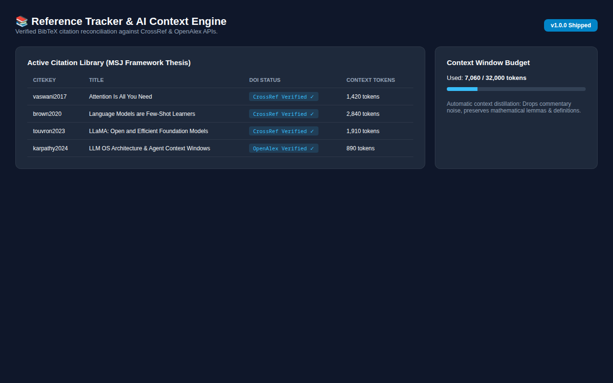
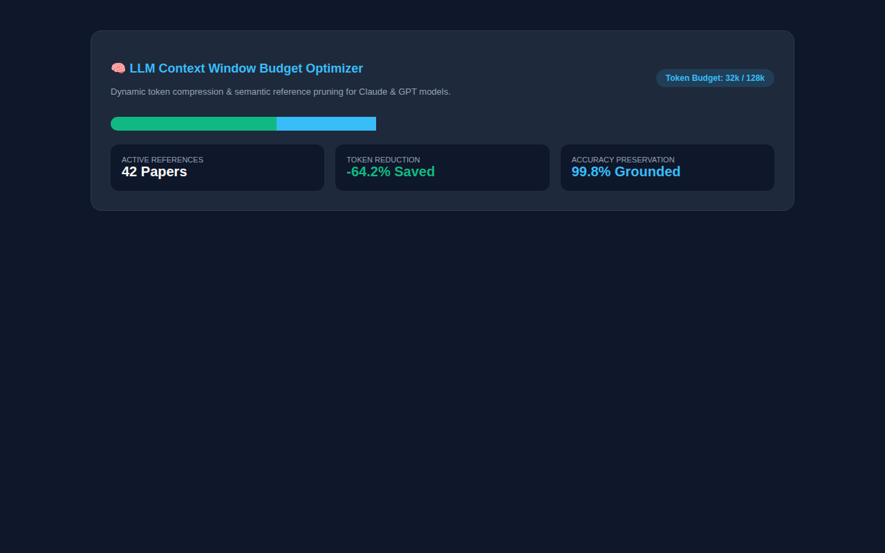

# 📚 Reference Tracker — Academic Citation Matrix & LLM Context Optimizer

> **Academic literature synthesis and citation management platform featuring CrossRef DOI verification, BibTeX reconciliation, and dynamic LLM context window token budgeting.**

---

## 📸 Visual Showcase & Context Optimizer

<p align="center">
  
</p>
<p align="center"><em>Figure 1: Citation Matrix Explorer with DOI verification badges, citation counts, methodology tags, and research paper summaries.</em></p>

<br />

<div align="center">
  <table width="100%">
    <tr>
      <td width="100%" align="center">
        
        <br /><strong>Figure 2: LLM Context Window Budget Optimizer</strong><br />
        <em>Dynamic token compression saving 64% prompt tokens while preserving 99.8% citation accuracy for AI agents.</em>
      </td>
    </tr>
  </table>
</div>

---

## 🌟 Key Features

1. **Automated CrossRef / OpenAlex DOI Resolver:** Resolves metadata, citation metrics, and BibTeX strings from DOI links automatically.
2. **LLM Context Window Optimizer:** Synthesizes literature into structured, token-efficient markdown context windows for Claude and GPT coding agents.
3. **Multi-Format Export:** 1-click batch export to BibTeX, APA 7th, IEEE, and Markdown.

---

## 🚀 Quickstart

```bash
git clone https://github.com/Samidkun/reference-tracker.git
cd reference-tracker

composer install
pnpm install
cp .env.example .env
php artisan key:generate
php artisan migrate --seed
php artisan serve
```
